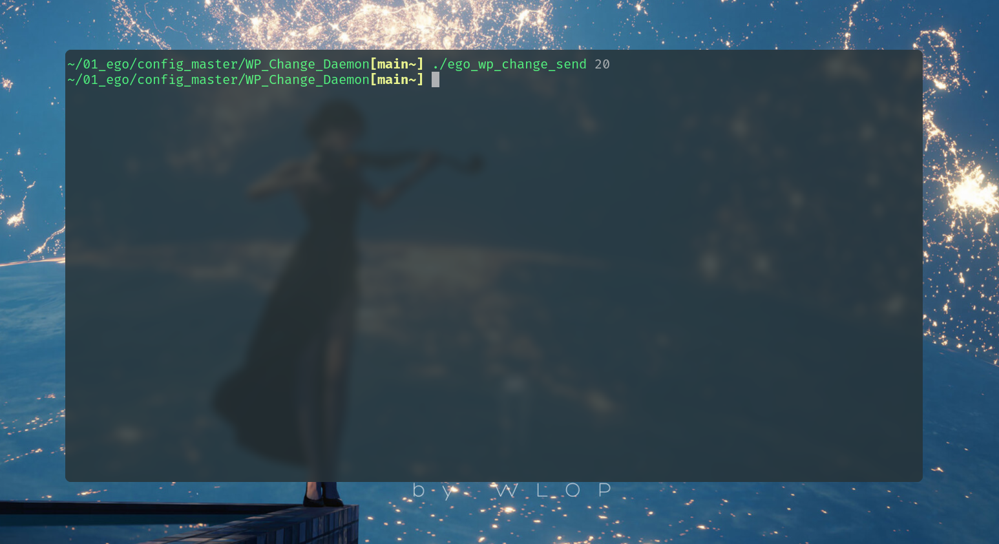

# WP Change Daemon

**Brief description**

This is a wallpaper-changing daemon that starts at the beginning of the system, based on feh. You can replace it with your command on your PC.

> For ubuntu
>
> ```shell
> sudo apt-get install feh
> ```

| Date       | Author  | Description                    |
| ---------- | ------- | ------------------------------ |
| 2023/12/04 | Manfred | First release                  |
| 2023/12/05 | Manfred | Add message queue for response |
| 2023/12/05 | Manfred | Add exit program action        |
| 2023/12/05 | Manfred | Add go back switch method      |


## Rough Design

**Features**

- Automatically change the wallpaper at predetermined intervals
- There are 3 methods to switch wallpapers: sequential, random, and by name


**Require**

- Offer a user-friendly interface interface
- Runs well with scripts


## Input/Output

| Event | Code | Action                                 |
| ----- | ---- | -------------------------------------- |
| 0     | 0    | Disable change-wallpaper automatically |
| 0     | 1    | Enable change-wallpaper automatically  |
| 1     | 0    | Switch **default method** to sequence  |
| 1     | 1    | Switch **default method** to random    |
| 2     | 0    | Set wallpaper sequentially             |
| 2     | 1    | Set wallpaper randomly                 |
| 3     | 0    | Go back to the previous wallpaper      |
| 3     | 1    | Exit program                           |
| 4 - 9 |      | Reserved                               |

**Example**

21 means:

> Event : 2
>
> Code : 1
>
> Action :   Set wallpaper randomly


## Guide

### **Tree**


### **Step -1-**

First you need to create a directory to store wallpapers, and then do some configuration in `ego_wp_change_daemon.c`


Notice : change the string named `wp_dir` at the end of this picture, replace it with your photo repository

### **Step -2-**

Compiling the code with command `make`, then `ego_wp_change_daemon` and `ego_wp_change_send` will be added in current directory


### **Step -3-**

Run `ego_wp_change_daemon` as a daemon in system, the wallpaper will run by default configuration.

```shell
./ego_wp_change_daemon &
```

Run `ego_wp_change_send` with parameters when you need to control the action of `ego_wp_change_daemon`, see **Input/Output** for more details about parameters.


**Example**

```c
./ego_wp_change_send 20
```

> Switch to the next wallpaper





### What's more

You may notice that there is a shell script named `ego_control.sh`, it is used with **Rofi**.

```bash
sudo apt-get install rofi
```

When you run this script for the first time, the `ego_wp_change_daemon` will be invoked. Afterward, you will encounter a user-friendly interface to control the `ego_wp_change_daemon` every time you run this script.


> When I called Rofi, it is embarrassing that I couldn't bring up my snipping tool to take a screen-shot

**As advice, it is recommended to execute this script at system startup, as that is how it was designed.**


